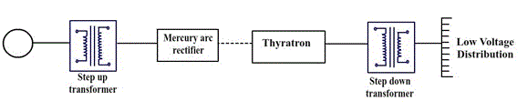

Feeders are line of conductors which connect the stations to the areas to be fed by those stations. Let us see transmission and distribution of electrical power in detail:

<u>**Transmission and distribution of electrical power**</u>  
By transmission and distribution of electrical power is meant its conveyance from the central station where it is generated to the places where it is demanded by the consumers (like pumping stations, residential and commercial buildings, mills, factories etc.)

<li>The maximum generated voltage in advanced countries is 33kV while that in India is 11kV.</li>
<li>The amount of power that has to be transmitted through transmission lines is very large and of this power is transmitted at 11kV (or 33kV) the line current and power loss would be very large. Therefore this voltage is stepped up to a higher value by using step up transformers located in sub-stations.</li>
<li>The transmission voltages in India are 400 kV, 220 kV and 132 kV.</li>
<li>The transmission lines and feeders are 3-phase 3-wire circuits.</li>
<li>The distributors are 3-phase 4-wire circuits because a neutral wire is necessary to supply the single-phase loads of domestic and commercial consumers.</li>
<li>The transmission network is commonly known as Grid.</li>

<u>**Electric supply system:**</u>

An electric supply system comprises of the following three principle components:

1. Power station.
2. Transmission lines.
3. Distribution lines.

The electrical system is broadly classified as follows:

1. D.C. or A.C. system.
2. Overhead or underground system.

The overhead system is less expensive than the underground one. In our country this system is mostly adopted for transmission and distribution of power.

fig(a)

The above figure shows a typical layout of power system between generation and use of electric power  
<u>The various components are discussed below</u>:

1. Generating station (GS): In generating station electric power is produced by 3-phase alternators operating in parallel.The normal generation voltage is 11kv (it may be 6.6kV or even 33kV in some cases). This voltage is stepped upto 132kV (or more) with the help of 3-phase transformers. Generally the transmission is carried at 66kV, 132kV, 220kV or 400kV.  
   **Note** : Whereas the use of high voltage leads to several advantages including saving of conductor material and high transmission efficiency, on the other hand, introduces insulation problems and increases cost of switchgear and transformer equipment.
2. Primary transmission: In this type of transmission, the electric power at 132kV is supplied to the other system by 3-phase 3-wire overhead system.
3. Secondary transmission: The primary transmission line terminates at the receiving station (RS) where the voltage isreduced to 33kV by step down transformers. From this station, the electric power is transmitted at 33kV to large consumers by 3-phase, 3-wire overhead system, and this forms the secondary transmission.
4. Primary distribution: The secondary transmission line terminates at sub-stations(SS) where voltage is reduced from 33kV to 11kV. The 11kV(3-phase,3-wire) lines run along the important road sides of the city.
   **Note**: The large/big consumers(having demand more than 50kw) are normally supplied power at 11kV which they handle it individually with their own substations.
5. Secondary distribution: The electric power available at 11kv from the primary distribution line is delivered to distribution substations (DSS, located near the locality of the consumers) which step down the voltage to 400V, 3-phase, 4-wire secondary distribution. The single phase residential lighting load is connected between any phase and neutral (230V) and 3-phase motor load is connected across 3-phase lines (400V) directly.  
   The secondary distribution system consists of feeders, distributors and service mains (see fig (b))

fig(b)

Low voltage (L.V.) distribution system

<li><strong>Feeders</strong>: These are line conductors which connect the stations to the areas, to be fed by those stations. Normally no tapping are taken from feeders. They are designed mainly from point of their current carrying capacities.</li>  
<li><strong>Distributors</strong>: These are conductors from which several tappings for the supply to the consumers are taken. They are designed from the point of view of the voltage drop in them.</li>
<li><strong>Service mains</strong>: These are the terminals which connect the consumer’s terminals to the distributors.</li>

<u>**Comparison between D.C. and A.C. systems of transmission and distribution
D.C. system**</u>:  
Few advantages: The transmission of electric power by high voltage D.C. systems has following advantages over high voltage A.C. system:

<li>DC systems are economical for long distance bulk power transmission by overhead lines.</li>
<li>Simple line construction.</li>
<li>Greater power per conductor.</li>
<li>Ground return is possible.</li>
<li>In DC system, only IR drop is present and IX drop is nil. Therefore voltage regulation problem is much less serious.</li>
<li>The power flow through a DC link is easily reversible and controlled.</li>
<li>In DC transmission, there is no inductance, capacitance, phase displacement and surge problem.</li>
<li>A DC line has less corona loss.</li>
<li>A DC line has reduced interference with communication circuits.</li>
<li>There is no skin effect in DC, X-section of line conductor is therefore fully utilized.</li>
<li>Because of less potential stress and negligible dielectric loss, underground cable can be used.</li>
<li>No stability problems.</li>
<li>No synchronizing difficulties.</li>
<li>In a DC system, potential stress on the insulation is 1/√2 times that in AC system for same working voltage, therefore less insulation is required in DC system.</li>

<u>**Disadvantages**</u>  
The high voltage DC systems have the following disadvantages:

<li>DC system uses complicated converters and DC switch gear is expensive. Thus installation is costly.</li>
<li>Electric power cannot be generated at high DC voltage due to commutator problems.</li>
<li>In DC system harmonics are generated which require filters.</li>
<li>Converters require considerable reactive power.</li>
<li>Converters do not have overload capability.</li>

<u>**AC system**</u>:  
Nowadays electrical energy is almost exclusively generated, transmitted and distributed in the form of A.C. Let us see its advantages and disadvantages.

<u>**Advantages**</u>:-

1. In A.C. system, the electric power can be generated at high voltage.
2. Maintenance of substations is easy and comparatively at a lower cost.
3. Stepping-up and stepping down of an A.C voltage can be done easily and efficiently with the help of transformers.

<u>**Disadvantages**</u>:-

1. There is a need to synchronize the alternators before they are put in parallel.
2. Transmission line construction is comparatively difficult and the amount of copper required is comparatively more.
3. In order to avoid corona loss and also to provide adequate amount of insulation in case of overhead lines, more spacing between the conductors is required.
4. As a result of skin effect, the resistance of the line is increased.
5. A.C line has capacitance, because of which there is a continues loss of power due to charging current even when the line is open.

<u>Note</u>:-

1. The best method is to use A.C system for generation and distribution purpose and DC system for transmission purpose.
2. By using mercury are rectifiers and thyratrons, it is possible to transmit electric power by DC system, which can convert AC into DC and vice-versa directly at a reasonable cost. These devices can handle 30 Megawatt at 400V.

Line diagram of typical H.V.D.C transmission lines

The above figure shows a single line diagram of high voltage DC (H.V.D.C) transmission. The generating station generates electric power which is AC. This voltage is stepped to high voltage by the use of step-up transformers. This A.C power at high voltage is fed to the mercury are rectifiers which converts AC into DC. This high DC voltage is transmitted. At receiving end the DC power converted to AC power using thyratrons. This AC voltage is then stepped down to low voltage for distribution by using a step-down transformer.

<u>**Choice of Transmission Voltage**</u>  
Whenever transmission lines are concerned there is a specific limit for the voltage to be used, beyond which there is no economical profit. The limit is reached when the cost of conductor, transformer, insulator, supports, switchgear, lightning arrester and the erection cost is “minimum”.

fig(c)

1. According to modern American practice (based on empirical formula) empirical line–to-line voltage (kV) is  
   V=5.5√(0.62l+(3P/100))  
   Where,  
   l=Distance of transmission in km,  
   P=Estimated maximum KW/phase to be delivered over a single circuit.
2. Voltage in kV(line-to-line),  
   V=5.5√(0.62l+(kVA/150))  
   Where,  
   l=Distance of transmission in km and kVA= Total power.

<u>**Underground cables and overhead lines**</u>  
Overhead lines and underground cables are the 2 ways for transmission or distribution of electric power. Most of the time overhead lines are used; underground cables are rarely used for the following reason:

1. Power is generally transmitted over long distances to load centres.
2. Installation costs are very high. Therefore, transmission of power over long distances is carried out by using overhead lines.

<u>**Important components of overhead lines**</u>I:

1. Conductors:- Conductors carry power from sending end station to receiving end station.
2. Supports:- These are the structures which keep the conductors at a suitable level above the ground; they can be poles or towers, depending upon the working voltage and the place where they are used.
3. Cross-arms:- Cross arms provide the necessary support to the insulators.
4. Insulators:- They provide insulation to high voltage wire with the metal structure and also provide support to the conductor. They also provide support to bus-bar conductors and other love high voltage equipment terminals.
5. Other miscellaneous items:
   1. Lightning arresters
   2. Fuse
   3. Isolating switches
   4. Guard wire
   5. Phase plates
   6. Vee guards
   7. Anticlimbing wires etc.

<u>**Conductors**</u>  
The following are the characteristics that conductor used for transmission and distribution should possess:

1. In order to withstand mechanical stress, it should have high tensile strength.
2. Low resistivity, so that it has high electrical conductivity.
3. In order to have small weight per unit volume it should have low specific gravity.
4. Low cost.

All these characteristics are not found in a single material. So, while selecting a conductor material for a particular case, a compromise is made between cost and electrical and mechanical properties.

<u>**Material used for transmission lines**</u>  
The most important leading material used for transmission lines is copper because it has tensile strength and high conductivity. Aluminium is also used to large extent especially with a steel core for high voltage line. The selection of materials depends upon the following criteria:

1. Required mechanical strength and electrical properties.
2. Cost of materials.
3. Local conditions.

List of other materials used for transmission lines are:

1. Galvanised steel materials.
2. Galvanised iron.
3. Steel core copper.
4. Cadmium copper materials etc.
5. Phosphor bronze materials etc.

Let us see few of them in brief.

1. <u>Copper</u>:-
   1. Copper that has not been annealed after being drawn (Hard drawn copper) conductor is one of the best conductors due to its high electrical conductivity and high tensile strength for all types of transmission. Hard drawing reduces electrical conductivity by a small amount but it increases the tensile strength considerably.
   2. It is a homogeneous material, durability is high and has high scrap value.
   3. It has a high current density so lesser X-sectional area of conductor is required.

Copper conductor having steel core are employed for long span transmission lines, where a combination of high conductivity, small sag and minimum cross-section are desired.

2. <u>Aluminium</u>:-

   1. Lighter in weight as compared to copper, but has smaller conductivity and tensile strength.
   2. Aluminium has 1.6 items the resistivity of copper. So for the same loss and length of conductor an aluminium conductor should have 60% greater x-sectional area than that of copper conductor. This increased X-section of aluminium exposes a greater surface to wind pressure. So the supporting towers must be designed for greater transvers strength. As consequences of greater sag, the use of higher towers is often required.
   3. The sag in aluminium conductors is greater than the copper conductors.
   4. They are particularly suitable for operation in very high ambient temperature.

3. <u>Steel cored aluminium (A.C.S.R)</u>  
   Aluminium has low tensile strength, as a result produce greater sag which prohibits their use for longer spans and makes them unsuitable for long distance transmissions. So in order to increase the tensile strength of the aluminium conductor, it is used with a core of galvanized steel wires. The combinational conductor thus obtained is called as A.C.S.R. (Aluminium Conductor Steel Reinforced).

fig(d)
A.S.C.R conductor

The above figure shows, one steel cored conductor wire surrounded by 18 wires of aluminium. The aluminium carries bulk of current while the steel core takes a greater percentage of mechanical stress.

<li> Produces small lag and therefore can be used for longer spans.</li>
<li> A.C.S.R. Conductor gets deteriorated in service due to atmospheric corrosion.</li>

4.  <u>Galvanised steel</u>

    i. Used for extremely long spans. Because of poor conductivity and high resistance of steel, they are not suitable for transmitting large power over a long distance.  
    ii. Steel wire or iron wire is most advantageous for transmission of small power over a short distance.

5.  <u>Cadmium copper</u>  
    Sometimes copper alloyed with cadmium is used. When 1 or 2 percentage of cadmium is added to copper it increases the tensile strength by about 40 percentages but reduces the conductivity only by 17 percentages. Cadmium copper is expensive than copper.

    <li> Economical for a line with long spans and small cross-section.</li>

<u>**Line support**</u>:-  
The following are the characteristics of line supports used for transmission and distribution of electric power.

<li>Light in weight and less expensive.</li>
<li>It should have high mechanical strength.</li>
<li>Low maintenance cost and longer life.</li>

These lines support can be wooden poles, steel poles, RCC poles and steel towers.

1. <u>Wooden poles</u>:

<li>Cheap, easily available has insulating properties and are most widely used for distribution purpose in rural areas.</li>
<li>Used for short spans, up to 60 metres.</li>
<li>The portion of the poles, which is below the ground level, is impregnated with preservative compounds like creosite oil.</li>
<li>In order to obtain high transverse strength, double pole structures like ‘A’ or ‘H’ type (fig e) are used.</li>
<li>Short life, up to 25 to 30 years.</li>

fig(e)

2. <u>Steel poles</u>

  <li>Has great mechanical strength and thus can be used for longer spans (50-80 metres), but they are costly.</li>
  <li>Majority of 3 types:

    i. Rail poles
    ii. Rolled steel joints
    iii. Tabular poles

</li>  
<li>Average life more than 40 years.</li>

4. <u>R.C.C. poles</u>
<li>R.C.C poles possess greater mechanical strength and can be used for longer span than steel poles(80-200 metres).</li>
<li>Good insulating properties and low maintenance.</li>
<li>They have a very long life.</li>

fig(f)  
R.C.C Poles

4.<u>Steel towers</u>

  <li>Wooden poles, steel poles, R.C.C. poles are used for distribution purpose at low voltage (say 11kV), but steel towers are invariably employed for long distance transmission at higher voltage.</li>
  <li>Troubles regarding lightning are minimised as each tower acts as a lightning conductor.</li>
  <li>Steel tower has greater mechanical strength.
  <li>Longer life span.</li>
  <li>Steel towers can withstand most severe climate conditions.</li>
  <li>Steel towers are suitable for longer spans.</li>

fig(g)  
R.C.C Poles

<u>**OVERHEAD LINE INSULATORS**</u>  
Insulators are used in order to provide safety and necessary clearance between live transmission conductors, which are completely bare and do not have any insulated coating over it.

<u>Required characteristics of an insulator</u>:-

1. It should have insulation resistance to avoid current leakage to earth.
2. It should have very high mechanical strength.
3. It should have high dielectric strength to provide high relative permittivity. Also, it should have high ratio of rapture strength to flash over voltage.

<u>Materials used for insulation</u>

1. Porcelain
2. Steatite
3. Glass
4. Synthetic resin

<u>Porcelain</u>

<li> Most commonly used material for insulator in overhead lines.</li>
<li> Porcelain is usually weak in tension and does not withstand tensile strength more than 50MN/m2</li>
<li> A good porcelain insulator has compressive strength of about 7000N/m2 and dielectric strength of 60kV/cm of its thickness.</li>
<li> Porcelain is mechanically stronger than glass.</li>

<u>Glass</u>

<li> Mainly used for E.H.V, AC and DC systems.</li>
<li> Glass insulator is cheaper than porcelain when simple shapes are considered.</li>
<li> Under ordinary atmospheric conditions the glass insulator can be used up to 25kV and in dry atmosphere, it can be used up to 50kV.</li>
<li> In H.V lines having voltage above 100kV, toughened glass is employed for insulation.</li>

<u>Steatite</u>

<li>It is produced by mixing hydrated magnesium silicate with small portion of clay and felspar.</li> 
<li> It has high insulation resistance.</li> 
<li> Steatite has much greater tensile and bending stress than porcelain. Thus can be used at tension towers or when the transmission lines take a sharp turn.</li>

<u>Synthetic resin</u>

<li> Synthetic resin is an insulator which is made up materials like rubber, silicon, resin etc.</li> 
<li> Synthetic resin insulator has high strength and lower weight.</li> 
<li> Leakage current is higher and longevity is low.</li> 
<li>Comparatively cheaper.</li>
<li> Used in various indoor application.</li> 
<li> Synthetic resin insulators are extensively used for bushings.</li>

<u>Types of insulators</u>

1. Pin type insulators.
2. Suspension type insulators.
3. Strain type insulators.
4. Shackle insulators.

1.<u>Pin type insulators</u>  
A pin type insulator is designed to be mounted on a pin, which in turn is installed on cross-arm of the pole. The insulator on the pin and electrical conductor is placed in the groove at the top of the insulator and soft aluminium binding wire according to the material of the conductor.

- Pin type insulators made of glass are generally used for low voltages.
- Pin type insulators made of porcelain can be used up to 90kV but are rarely used on lines above 60kV.

fig(h)  
Pin Type Insulator

2. <u>Suspension type insulators</u>

<li> In a pin type insulator its cost is increased rapidly as the working voltage is increased. Therefore pin type insulator is not economical beyond 33kV. So it is as usual practice to use suspension type insulators for voltage higher than 33kV.</li>
<li> A pin type insulator sits on top of the cross arm, whereas a suspension insulator hangs from the cross arm. The line conductor is attached to its lower end.</li>

Few advantages of suspension type insulators over Pin type insulators are:

<li> Usually cheaper in cost for operating voltage above 50kV.</li>
<li> Flexibility is increased with suspension insulators.</li>
<li> If line insulation needs to be increased, the additional insulators can be easily added to the string. In case there is damage in any insulator, the damaged insulator can be easily replaced.</li>

fig(i)  
Suspension type insulator

fig(j)

3. <u>Strain insulators</u>  
   Strain insulators can be of pin type insulator or suspension type insulator. Strain insulators are made use when making very long spans or corners of transmission lines.

fig(j)

<u>Shackle insulators</u>  
Shackle insulators can be fixed to a pole directly with a bolt or to the cross arm. The line conductor is fixed in the groove with a soft binding wire. Before, shackle insulators were used as strain insulator, but these days they are used for low voltage distribution lines.

fig(l)  
Shackle insulator

<u>The reason for failure of insulators</u>

1. Mechanical stress
2. Short circuits
3. Flash-over
4. Cracking of insulator, dust deposition, porosity of material etc.

<u>Sag in overhead lines</u>:  
In transmission lines, the conductors are supported at the towers or poles. When the conductor supported in this manner it will sag or dip under its own weight and it takes the shape of catenary.
The distance between the adjacent supporting towers is called the “span”. The difference in level between the points of supports and the lowest points is known as sag.

The factors affecting the sag in overhead lines are:

1. Weight of the conductor:The weight of the conductor directly affects the sag. Heavier the conductor, greater will be the sag.
2. Span length: Sag is directly proportional to the square of the span length, provided other conditions remain unchanged.
3. If other conditions are remaining the same, then the sag is inversely proportional to the working tensile strength.
4. Sag increases with the increase in temperature.

<u>**Note**</u>:-  
Few important terms:

1. <u>Skin effect</u>:
   When direct currents are concerned, the direct current distributes themselves uniformly over the cross-section of the conductor and therefore use the centre of the conductor as effectively as they use the periphery. When alternating current is concerned, ac owing to inductance effects within the conductor, crowd toward the outside of the conductor. This behaviour is termed as ‘skin effect’. Skin effect raises the apparent resistance of the conducting material, only the total resistance of conductor is changed depending upon the frequency of the current and also the diameter of the conductor. The total resistance of the conductor increases, as the frequency of the current increases, and also increases with the increase in the diameter of the conductor. The current carried by the centre portion of the conductors is reduced by skin effect, thus hollow conductors are sometimes employed to use them more effectively. More often instead of hollow conductor, Aluminium cable steel reinforced (ACSR) is used.
   The skin effect is negligible when the supply frequency is low (<50Hz) and the conductor diameter is small (<1cm)

2. <u>Proximity Effect</u>:
   The alternating magnetic flux in a conductor caused by the current following in a neighbouring conductor gives rise to circulating currents which cause an apparent increase in the resistance of a conductor. This phenomenon is called “proximity effect”.
   Proximity effect is always of negligible order for normal spinning of overhead lines. However, for underground cables where conductors are spaced closely to each other, the effective resistance of the conductor is greatly increased due to proximity effect.

The factors which effect skin and proximity effects are:-

1. Frequency of the current.
2. Permeability of the conductor material.
3. Size of the conductor and distance between the conductors.

<u>**Classification of transmission lines**</u>

The transmission lines can be generally classified as follows;

1. Short transmission lines.
2. Medium transmission lines.
3. Long transmission line.

<u>**Short transmission lines**</u>

<li>Length less than 50km.</li>
<li>Operating voltage less than 20kV.</li>

<u>**Medium transmission lines**</u>

<li>Length between 50km and 160km.</li>
<li>Operating voltage is between 21kV and 100kV.</li>

<u>**Long transmission lines**</u>

<li>Length more than 160km.</li>
<li>Operating voltage is above 100kV.</li>

